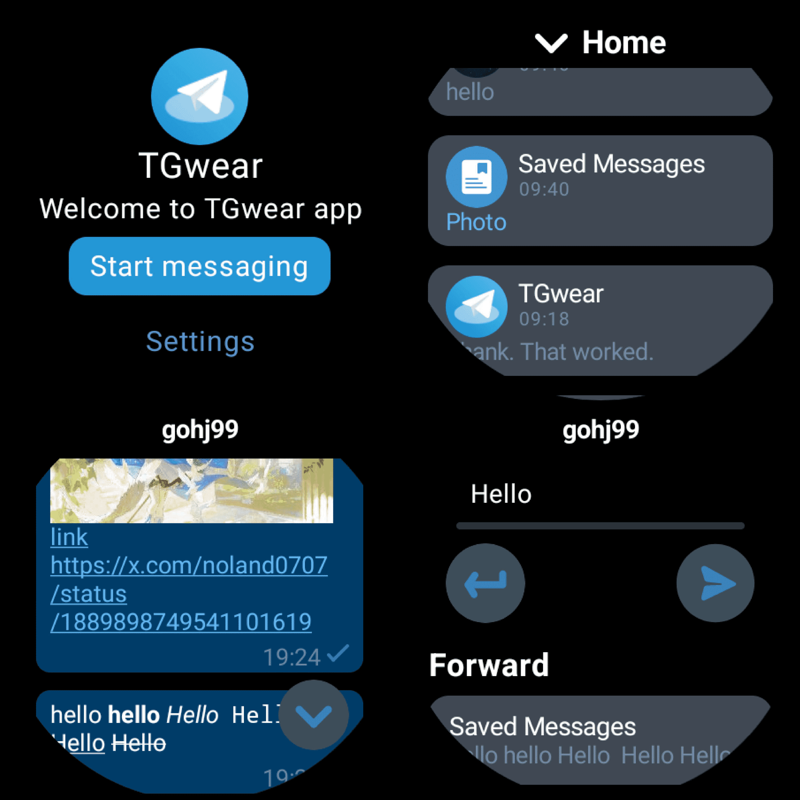

<a href="https://github.com/TGwear/TGwear">

</a>

<div align="center">
  <br/>
  <div>
      繁體中文 | <a href="./README.md">English</a> | <a href="./README.zh-CN.md">简体中文</a> | <a href="./README.ja-JP.md">日本語</a>
  </div>
  <br/>

<div>
    <a href="https://github.com/TGwear/TGwear/blob/master/LICENSE">
      
    </a >
    <a href="https://github.com/TGwear/TGwear/releases">
        
    </a >
	<a href="https://github.com/MShawon/github-clone-count-badge">
        
    </a >
  </div>
</div>



## ダウンロード

ダウンロード: [TGwear](https://github.com/TGwear/TGwear/releases)  
ADB シェル:

1. リリースから TGwear をダウンロードする
2. インストール:

```shell
adb install TGwear.apk
```

## 関数

- サポートトピックチャット
- FCM メッセージ通知、クイックビュー、既読マーク、返信
- 複数アカウント対応
- インターフェースのカスタマイズ
- 完全なメッセージグループ化のサポート
- 未読/既読インジケーター
- 接続状態インジケーター
- テキスト、画像、ビデオの閲覧またはダウンロード
- 音声メッセージを再生
- メッセージの返信と転送
- 画像やビデオの保存
- テキスト送信
- メッセージ削除
- クラウンローテーションのサポート

## 最小構成と推奨構成

- 最小メモリ (RAM): 1G
- 最小ストレージ容量 (ROM): 8G
- 最小互換性システム: Android 7.0 (API レベル 24 Nougat)
- 推奨メモリ (RAM): 2G
- 推奨ストレージ容量（ROM）：16G
- 推奨システム: Android 11 (API レベル 30 R) または Wear OS 3.0 (API レベル 30)

＃＃ コミュニティ

フィードバックを提供するには、[issue](https://github.com/TGwear/TGwear/issues) を使用することをお勧めします。
もちろん、次のようなフィードバック方法も可能です。

- [テレグラム](https://t.me/teleTGwear)

## Star History

<a href="https://star-history.com/#TGwear/TGwear&Date">
 <picture>
   <source media="(prefers-color-scheme: dark)" srcset="https://api.star-history.com/svg?repos=TGwear/TGwear&type=Date&theme=dark" />
   <source media="(prefers-color-scheme: light)" srcset="https://api.star-history.com/svg?repos=TGwear/TGwear&type=Date" />
   
 </picture>
</a>
